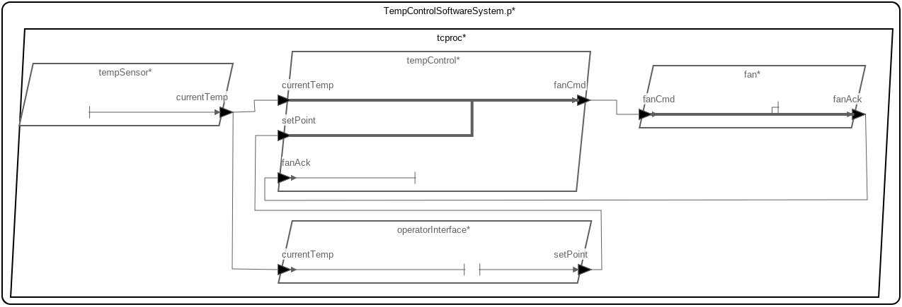

# <!--start__temperature-control-periodic-title-->Temperature Control Periodic<!--end____temperature-control-periodic-title-->
<!--start__temperature-control-periodic-description-->
The data, links, and images in this file are auto-generated from HAMR's report generation facility. Additional text explanations have been added for readability.
<!--end____temperature-control-periodic-description-->
## <!--start__temperature-control-periodic_arch-section-title-->AADL Architecture<!--end____temperature-control-periodic_arch-section-title-->
<!--start__temperature-control-periodic_arch-section-description-->

The following documentation blocks provide links to AADL textual representation source of the Thread components in the system.
* "Type" links to the AADL component type declaration (providing the port-based interface for the component)
* "Behavior Specification" (when present) links to the GUMBO behavior contract for the component. HAMR automatically
compiles the GUMBO contract to both an code-level contract used for Logika code verification as well as an executable
representation of the contract (as pure boolean functions) used in unit and system testing.
<!--end____temperature-control-periodic_arch-section-description-->
<!--start__temperature-control-periodic_arch-section_aadl-arch-component-info-tempcontrolsoftwaresystem_p_instance-->
|System: [TempControlSoftwareSystem::TempControlSoftwareSystem.p](aadl/packages/TempControlSoftwareSystem.aadl#L60)|
|:--|
<!--end____temperature-control-periodic_arch-section_aadl-arch-component-info-tempcontrolsoftwaresystem_p_instance-->
<!--start__temperature-control-periodic_arch-section_aadl-arch-component-info-fan-fan-->
|Thread: Fan <!--[fan](aadl/packages/TempControlSoftwareSystem.aadl#L80)--> |
|:--|
|Type: [CoolingFan::FanPeriodic](aadl/packages/CoolingFan.aadl#L32) Implementation: [CoolingFan::FanPeriodic.p](aadl/packages/CoolingFan.aadl#L58)|
|Periodic: 1000 ms|

<!--end____temperature-control-periodic_arch-section_aadl-arch-component-info-fan-fan-->
<!--start__temperature-control-periodic_arch-section_aadl-arch-component-info-operatorinterface-opinterface-->
|Thread: OpInterface <!--[operatorInterface](aadl/packages/TempControlSoftwareSystem.aadl#L82)--> |
|:--|
|Type: [TempControlSoftwareSystem::OperatorInterfacePeriodic](aadl/packages/TempControlSoftwareSystem.aadl#L210) Implementation: [TempControlSoftwareSystem::OperatorInterfacePeriodic.p](aadl/packages/TempControlSoftwareSystem.aadl#L234)|
|Periodic: 1000 ms|

<!--end____temperature-control-periodic_arch-section_aadl-arch-component-info-operatorinterface-opinterface-->
<!--start__temperature-control-periodic_arch-section_aadl-arch-component-info-tempcontrol-tempcontrol-->
|Thread: TempControl <!--[tempControl](aadl/packages/TempControlSoftwareSystem.aadl#L81)--> |
|:--|
|Type: [TempControlSoftwareSystem::TempControlPeriodic](aadl/packages/TempControlSoftwareSystem.aadl#L111) Implementation: [TempControlSoftwareSystem::TempControlPeriodic.p](aadl/packages/TempControlSoftwareSystem.aadl#L198) Behavior Specification: [GUMBO](aadl/packages/TempControlSoftwareSystem.aadl#L131)|
|Periodic: 1000 ms|

<!--end____temperature-control-periodic_arch-section_aadl-arch-component-info-tempcontrol-tempcontrol-->
<!--start__temperature-control-periodic_arch-section_aadl-arch-component-info-tempsensor-tempsensor-->
|Thread: TempSensor <!--[tempSensor](aadl/packages/TempControlSoftwareSystem.aadl#L79)--> |
|:--|
|Type: [TempSensor::TempSensorPeriodic](aadl/packages/TempSensor.aadl#L45) Implementation: [TempSensor::TempSensorPeriodic.p](aadl/packages/TempSensor.aadl#L71) Behavior Specification: [GUMBO](aadl/packages/TempSensor.aadl#L60)|
|Periodic: 1000 ms|

<!--end____temperature-control-periodic_arch-section_aadl-arch-component-info-tempsensor-tempsensor-->

## <!--start__temperature-control-periodic_behavior-code-title-->Behavior Code<!--end____temperature-control-periodic_behavior-code-title-->
<!--start__temperature-control-periodic_behavior-code-description-->
The following items link to the Slang source code for the application logic of each thread.
In the HAMR development workflow, skeletons for these files are automatically created,
along with APIs for communicating over model-declared ports in the component type.
GUMBO component contracts in the AADL model are automatically translated to Slang/Logika
contracts and included in the generated skeletons. Then, the application developer uses a
conventional development approach for coding the application logic in Slang
(C workflows are also supported). Logika can be applied to verify that the user's
application code conforms to the generated Logika contracts (which are derived
automatically from model-level GUMBO contracts). The HAMR build framework will integrate
the user-code application logic for each component (below) with auto-generated threading
and communication infrastructure code, along with HAMR's implementation of AADL run-time
(based on AADL's standardized Run-Time Services). Note that HAMR is smart enough to
accommodate changes to model-level interface declarations (ports, etc.) as well as changes
to GUMBO contracts -- user code will not be clobbered when the model is changed and HAMR
code generation is rerun. Instead, HAMR uses specially designed delimiters in the
application code files to, e.g., re-weave updated contracts into the application code.

Executable Slang versions of the GUMBO contracts (referred to as "GUMBOX" contracts)
are also automatically generated in the code generation process. These executable
contracts are automatically integrated into the unit testing process: appropriate
portions of the executable contracts are invoked in the pre-state and the post-state
of a thread dispatch to dynamically check that the thread's behavior for that particular
dispatch conforms to the model-level GUMBO contracts.
<!--end____temperature-control-periodic_behavior-code-description-->
<!--start__temperature-control-periodic_behavior-code_slang-code-tempsensor-tempsensor-->
[TempSensor](hamr/slang/src/main/component/tc/TempSensor/TempSensorPeriodic_p_tcproc_tempSensor.scala)
 [GumboX](hamr/slang/src/main/bridge/tc/TempSensor/TempSensorPeriodic_p_tcproc_tempSensor_GumboX.scala)
<!--end____temperature-control-periodic_behavior-code_slang-code-tempsensor-tempsensor-->
<!--start__temperature-control-periodic_behavior-code_slang-code-fan-fan-->
[Fan](hamr/slang/src/main/component/tc/CoolingFan/FanPeriodic_p_tcproc_fan.scala)

<!--end____temperature-control-periodic_behavior-code_slang-code-fan-fan-->
<!--start__temperature-control-periodic_behavior-code_slang-code-tempcontrol-tempcontrol-->
[TempControl](hamr/slang/src/main/component/tc/TempControlSoftwareSystem/TempControlPeriodic_p_tcproc_tempControl.scala)
 [GumboX](hamr/slang/src/main/bridge/tc/TempControlSoftwareSystem/TempControlPeriodic_p_tcproc_tempControl_GumboX.scala)
<!--end____temperature-control-periodic_behavior-code_slang-code-tempcontrol-tempcontrol-->
<!--start__temperature-control-periodic_behavior-code_slang-code-operatorinterface-opinterface-->
[OpInterface](hamr/slang/src/main/component/tc/TempControlSoftwareSystem/OperatorInterfacePeriodic_p_tcproc_operatorInterface.scala)
 [GumboX](hamr/slang/src/main/bridge/tc/TempControlSoftwareSystem/OperatorInterfacePeriodic_p_tcproc_operatorInterface_GumboX.scala)
<!--end____temperature-control-periodic_behavior-code_slang-code-operatorinterface-opinterface-->

## <!--start__temperature-control-periodic_metrics-title-->Metrics<!--end____temperature-control-periodic_metrics-title-->
<!--start__temperature-control-periodic_metrics-description-->
<!--end____temperature-control-periodic_metrics-description-->
### <!--start__temperature-control-periodic_metrics_aadl-metrics-title-->AADL Metrics<!--end____temperature-control-periodic_metrics_aadl-metrics-title-->
<!--start__temperature-control-periodic_metrics_aadl-metrics-description-->
The following section provides statistics about the AADL model to give a rough idea of
its size (in terms of number of AADL modeling elements that impact the size of the deployed system).
<!--end____temperature-control-periodic_metrics_aadl-metrics-description-->
<!--start__temperature-control-periodic_metrics_aadl-metrics_aadl-metrics-content-block-->
| | |
|:--|:--|
|Threads|4|
|Ports|9|
|Connections|5|
<!--end____temperature-control-periodic_metrics_aadl-metrics_aadl-metrics-content-block-->

### <!--start__temperature-control-periodic_metrics_jvm-metrics-title-->JVM Metrics<!--end____temperature-control-periodic_metrics_jvm-metrics-title-->
<!--start__temperature-control-periodic_metrics_jvm-metrics-description-->
The following section provides statistics about the Slang source code.
<!--end____temperature-control-periodic_metrics_jvm-metrics-description-->
<!--start__temperature-control-periodic_metrics_jvm-metrics_temperature-control-periodic_code_metrics-->
Directories Scanned Using [https://github.com/AlDanial/cloc](https://github.com/AlDanial/cloc) v1.94:
- [hamr/slang/src/main](hamr/slang/src/main)

<u><b>Total LOC</b></u>

Total number of HAMR-generated and developer-written lines of code
Language|files|blank|comment|code
:-------|-------:|-------:|-------:|-------:
Scala|73|2773|1364|11485
--------|--------|--------|--------|--------
SUM:|73|2773|1364|11485

<u><b>User LOC</b></u>

The number of lines of code written by the developer.
"Log" are lines of code used for logging that
likely would be excluded in a release build
 |Type|code |
 |:--|--:|
 |Behavior|97|
 |Log|6|
 |--------|--------|
 |SUM:|103|
<!--end____temperature-control-periodic_metrics_jvm-metrics_temperature-control-periodic_code_metrics-->

## <!--start__temperature-control-periodic_gumbox-unit-testing-setup-title-->GUMBOX Unit Testing<!--end____temperature-control-periodic_gumbox-unit-testing-setup-title-->
<!--start__temperature-control-periodic_gumbox-unit-testing-setup-description-->
<!--end____temperature-control-periodic_gumbox-unit-testing-setup-description-->
### <!--start__temperature-control-periodic_gumbox-unit-testing-setup_configurations-title-->Unit Test Run Configurations<!--end____temperature-control-periodic_gumbox-unit-testing-setup_configurations-title-->
<!--start__temperature-control-periodic_gumbox-unit-testing-setup_configurations-description-->
<!--end____temperature-control-periodic_gumbox-unit-testing-setup_configurations-description-->
#### <!--start__temperature-control-periodic_gumbox-unit-testing-setup_configurations_fan_configurations-title-->Fan<!--end____temperature-control-periodic_gumbox-unit-testing-setup_configurations_fan_configurations-title-->
<!--start__temperature-control-periodic_gumbox-unit-testing-setup_configurations_fan_configurations-description-->
- Auto-generated GUMBOX Unit Test Harness [link](hamr/slang/src/test/bridge/tc/CoolingFan/FanPeriodic_p_tcproc_fan_GumboX_UnitTests.scala)
- Auto-generated component coverage report using the configurations below [link](https://people.cs.ksu.edu/~santos_jenkins/pub/gumbox-journal/custom_configs/tc/FanPeriodic_p_tcproc_fan_DSC_UnitTests/report.html)

    - Configurations for the Compute Entrypoint
      <table>
        <tr><td valign=top><a href="hamr/slang/src/test/util/tc/CoolingFan/FanPeriodic_p_tcproc_fan_UnitTestConfiguration_Util.scala#L22">Default_Compute_Config</a></td><td>Default Compute Configuration</td></tr>
      </table>

<!--end____temperature-control-periodic_gumbox-unit-testing-setup_configurations_fan_configurations-description-->

#### <!--start__temperature-control-periodic_gumbox-unit-testing-setup_configurations_opinterface_configurations-title-->OpInterface<!--end____temperature-control-periodic_gumbox-unit-testing-setup_configurations_opinterface_configurations-title-->
<!--start__temperature-control-periodic_gumbox-unit-testing-setup_configurations_opinterface_configurations-description-->
- Auto-generated GUMBOX Unit Test Harness [link](hamr/slang/src/test/bridge/tc/TempControlSoftwareSystem/OperatorInterfacePeriodic_p_tcproc_operatorInterface_GumboX_UnitTests.scala)
- Auto-generated component coverage report using the configurations below [link](https://people.cs.ksu.edu/~santos_jenkins/pub/gumbox-journal/custom_configs/tc/OperatorInterfacePeriodic_p_tcproc_operatorInterface_DSC_UnitTests/report.html)

    - Configurations for the Initialize Entrypoint
      <table>
        <tr><td valign=top><a href="hamr/slang/src/test/util/tc/TempControlSoftwareSystem/OperatorInterfacePeriodic_p_tcproc_operatorInterface_UnitTestConfiguration_Util.scala#L22">Default_Initialize_Config</a></td><td>Default Initialize Configuration</td></tr>
      </table>

    - Configurations for the Compute Entrypoint
      <table>
        <tr><td valign=top><a href="hamr/slang/src/test/util/tc/TempControlSoftwareSystem/OperatorInterfacePeriodic_p_tcproc_operatorInterface_UnitTestConfiguration_Util.scala#L38">Default_Compute_Config</a></td><td>Default Compute Configuration</td></tr>
      </table>

<!--end____temperature-control-periodic_gumbox-unit-testing-setup_configurations_opinterface_configurations-description-->

#### <!--start__temperature-control-periodic_gumbox-unit-testing-setup_configurations_tempcontrol_configurations-title-->TempControl<!--end____temperature-control-periodic_gumbox-unit-testing-setup_configurations_tempcontrol_configurations-title-->
<!--start__temperature-control-periodic_gumbox-unit-testing-setup_configurations_tempcontrol_configurations-description-->
- Auto-generated GUMBOX Unit Test Harness [link](hamr/slang/src/test/bridge/tc/TempControlSoftwareSystem/TempControlPeriodic_p_tcproc_tempControl_GumboX_UnitTests.scala), that was subsequently modified to provide custom configurations
- Auto-generated component coverage report using the configurations below [link](https://people.cs.ksu.edu/~santos_jenkins/pub/gumbox-journal/custom_configs/tc/TempControlPeriodic_p_tcproc_tempControl_DSC_UnitTests/report.html).  Custom configurations were used for this component. Click [here](https://people.cs.ksu.edu/~santos_jenkins/pub/gumbox-journal/default_configs/tc/TempControlPeriodic_p_tcproc_tempControl_DSC_UnitTests/report.html)
for the coverage report obtained when only the default configurations are used

    - Configurations for the Initialize Entrypoint
      <table>
        <tr><td valign=top><a href="hamr/slang/src/test/util/tc/TempControlSoftwareSystem/TempControlPeriodic_p_tcproc_tempControl_UnitTestConfiguration_Util.scala#L22">Default_Initialize_Config</a></td><td>Default Initialize Configuration</td></tr>
      </table>

    - Configurations for the Compute Entrypoint
      <table>
        <tr><td valign=top><a href="hamr/slang/src/test/bridge/tc/TempControlSoftwareSystem/TempControlPeriodic_p_tcproc_tempControl_GumboX_UnitTests.scala#L23">Custom_ComputewL_Config</a></td><td>Set ranges based on requirements - i.e. 50 <= SetPoint.Low and SetPoint.High <= 110 and -128 <= current_temp <= 134</td></tr>
      </table>

<!--end____temperature-control-periodic_gumbox-unit-testing-setup_configurations_tempcontrol_configurations-description-->

#### <!--start__temperature-control-periodic_gumbox-unit-testing-setup_configurations_tempsensor_configurations-title-->TempSensor<!--end____temperature-control-periodic_gumbox-unit-testing-setup_configurations_tempsensor_configurations-title-->
<!--start__temperature-control-periodic_gumbox-unit-testing-setup_configurations_tempsensor_configurations-description-->
- Auto-generated GUMBOX Unit Test Harness [link](hamr/slang/src/test/bridge/tc/TempSensor/TempSensorPeriodic_p_tcproc_tempSensor_GumboX_UnitTests.scala)
- Auto-generated component coverage report using the configurations below [link](https://people.cs.ksu.edu/~santos_jenkins/pub/gumbox-journal/custom_configs/tc/TempSensorPeriodic_p_tcproc_tempSensor_DSC_UnitTests/report.html)

    - Configurations for the Initialize Entrypoint
      <table>
        <tr><td valign=top><a href="hamr/slang/src/test/util/tc/TempSensor/TempSensorPeriodic_p_tcproc_tempSensor_UnitTestConfiguration_Util.scala#L22">Default_Initialize_Config</a></td><td>Default Initialize Configuration</td></tr>
      </table>

    - Configurations for the Compute Entrypoint
      <table>
        <tr><td valign=top><a href="hamr/slang/src/test/util/tc/TempSensor/TempSensorPeriodic_p_tcproc_tempSensor_UnitTestConfiguration_Util.scala#L38">Default_Compute_Config</a></td><td>Default Compute Configuration</td></tr>
      </table>

<!--end____temperature-control-periodic_gumbox-unit-testing-setup_configurations_tempsensor_configurations-description-->
